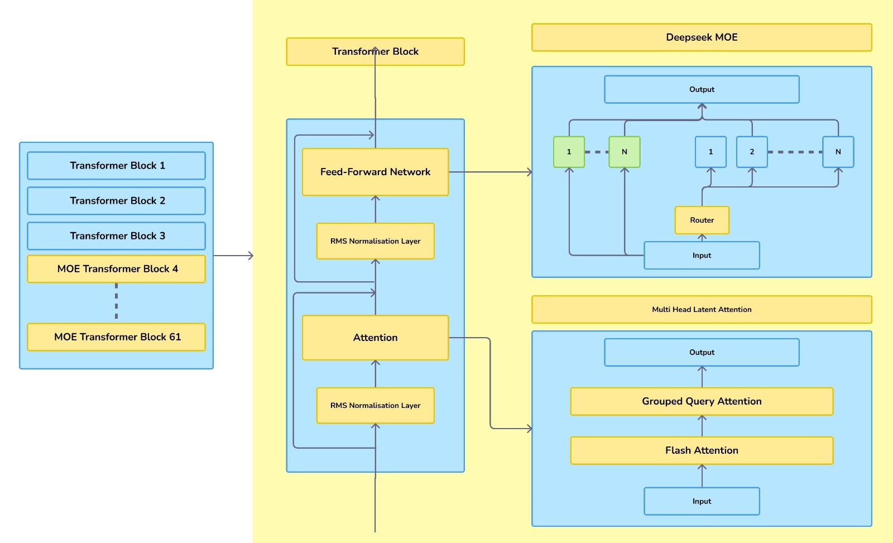
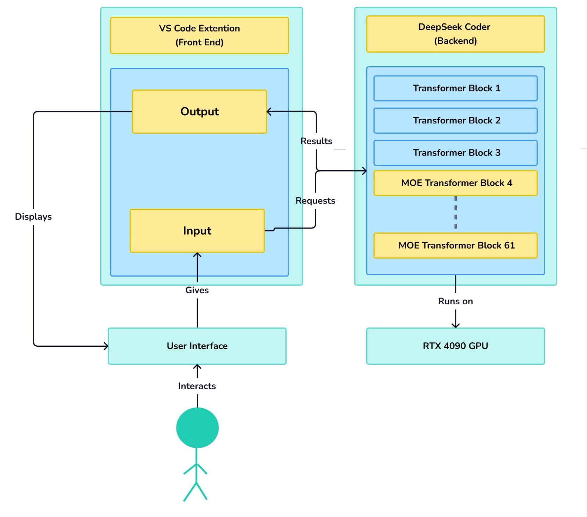

# 🧞‍♂️ CodeGenie — AI-Powered VS Code Extension

**CodeGenie** is a Visual Studio Code extension that integrates generative AI directly into your coding workflow. Designed by developers, for developers — it empowers users with intelligent suggestions, code generation, debugging assistance, and more.

---

## 🚀 Introduction

CodeGenie is an **AI-powered coding assistant** built to transform how software is developed. It leverages **DeepSeek Coder** to provide context-aware code suggestions, detect and correct errors, and optimize code quality — all from within your editor.

Designed to support a wide range of programming languages and frameworks, CodeGenie is a versatile companion for:

- Web development
- Machine learning and data science
- Software engineering
- Scripting and automation

Its interactive UI and seamless **VS Code integration** allow developers to work faster and smarter without leaving their environment.

---

## 🎯 Purpose

CodeGenie aims to streamline development workflows by offering:

- ✅ Context-aware code suggestions
- 🛠️ Real-time error detection and fixes
- ⚙️ Code optimization and refactoring
- 🌐 Support for multiple programming languages and frameworks

---

## 💡 Use Cases

- **Web Development**: Assist with frontend (HTML, CSS, JS) and backend (Node.js, Django, etc.) code
- **ML & Data Science**: Generate model scripts, data cleaning code, and pipelines
- **General Software Engineering**: Automate repetitive tasks, generate boilerplate, and follow best practices
- **Debugging**: Spot and fix errors more efficiently
- **Learning & Exploration**: Experiment with code through natural language queries

---

## 🧠 Powered by DeepSeek Coder

### 🔍 [DeepSeek Coder](https://arxiv.org/pdf/2401.14196)

DeepSeek Coder is a suite of open-source code LLMs (1.3B–33B parameters) trained on **2 trillion tokens** from 87+ programming languages. It introduces advanced techniques like **Fill-In-the-Middle (FIM)** for superior context modeling.

- Outperforms open-source baselines by **5x**
- Rivals **ChatGPT-3.5 Turbo** in coding tasks
- Includes **Instruct-tuned** and **v1.5** variants with enhanced capabilities

Its training corpus is rigorously curated — only **high-quality code** passes through compiler checks, syntax validation, and deduplication, resulting in a robust, real-world dataset.

---

### 🔬 [DeepSeek Coder V2](https://arxiv.org/pdf/2406.11931)

The next generation — **DeepSeek Coder V2** — takes things further:

- Trained on **10.2 trillion tokens** (code + math + natural language)
- Supports **338+ programming languages**
- Uses a **Mixture-of-Experts (MoE)** architecture:
  - 16B model with 2.4B active params
  - 236B model with 21B active params
- Handles **128K token** context windows for large project understanding

It achieves **state-of-the-art performance** across coding benchmarks, nearly matching or exceeding **GPT-4o**. With improved reasoning and context awareness, it's a top-tier open-source coding model.

---

## 📐 Architecture Diagram

---

## 🔄 Workflow Diagram

---

## 📝 License

This project is licensed under the **MIT License** — free for personal and commercial use.

---

## 🙌 Contributions

We welcome contributions and collaboration! Fork the repo, make your changes, and submit a pull request to help improve CodeGenie for everyone.

> Let the Genie code it for you ✨
